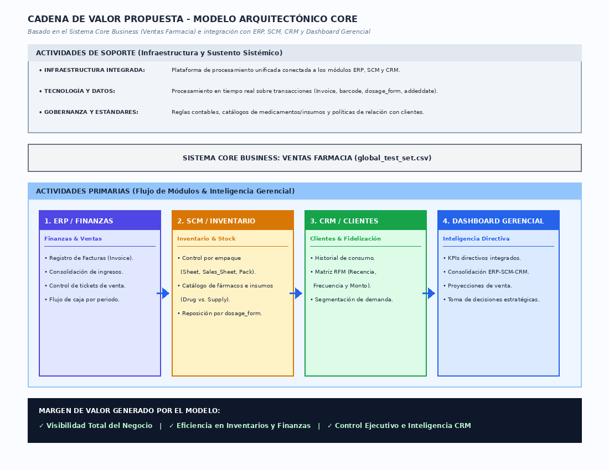
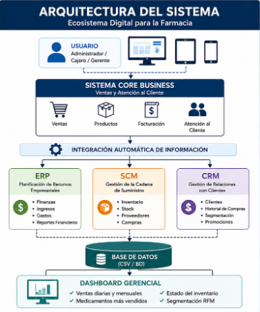
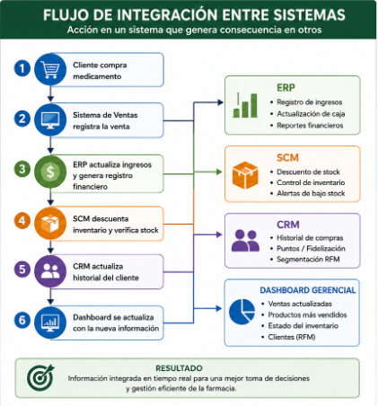
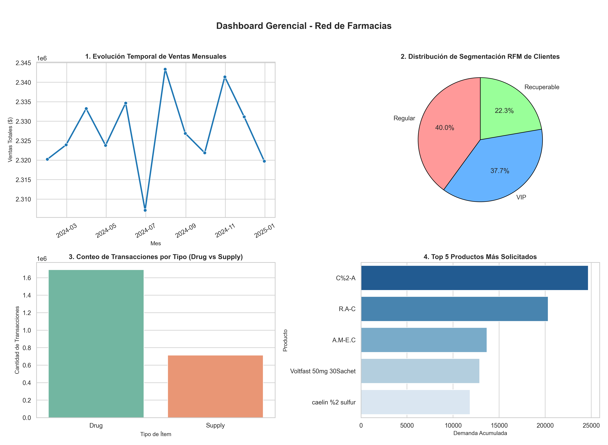

# INFORME TÉCNICO Y EJECUTIVO

# TRANSFORMACION DIGITAL EMPRESARIAL

## ISID223 — Introducción a los Sistemas de Información 2026-A

**Profesor:** Iván Carrera — EPN-FIS

**Estudiantes:** Gabriel Quilachamin - Samuel Lucero

**Proyecto:** Transformacion Digital de una Farmacia

**Fecha:** 24 de Julio de 2026

**Estado del Proyecto:**  COMPLETADO

---

# Índice

1. Resumen Ejecutivo
2. Diseño Estratégico
3. Documentación Técnica
4. Reporte de Inteligencia
5. Anexos

---
## Estructura del Proyecto  

```text
│   Informe.md
│   ProyectoFinal_ISID223_Quilachamin_Lucero_demo_live.ipynb
│
├───.vscode
│       settings.json
│
├───data_center
│       global_test_set.csv
│       Ph01_Z01_C01.csv
│       Ph01_Z01_C02.csv
│       Ph01_Z01_C03.csv
│       Ph01_Z02_C01.csv
│       Ph01_Z02_C02.csv
│       Ph01_Z02_C03.csv
│       Ph01_Z03_C01.csv
│       Ph01_Z03_C02.csv
│       Ph01_Z03_C03.csv
│       Ph02_Z01_C01.csv
│       Ph02_Z01_C02.csv
│       Ph02_Z01_C03.csv
│       Ph02_Z02_C01.csv
│       Ph02_Z02_C02.csv
│       Ph02_Z02_C03.csv
│       Ph02_Z03_C01.csv
│       Ph02_Z03_C02.csv
│       Ph02_Z03_C03.csv
│       Ph03_Z01_C01.csv
│       Ph03_Z01_C02.csv
│       Ph03_Z01_C03.csv
│       Ph03_Z02_C01.csv
│       Ph03_Z02_C02.csv
│       Ph03_Z02_C03.csv
│       Ph03_Z03_C01.csv
│       Ph03_Z03_C02.csv
│       Ph03_Z03_C03.csv
│       Ph04_Z01_C01.csv
│       Ph04_Z01_C02.csv
│       Ph04_Z01_C03.csv
│       Ph04_Z02_C01.csv
│       Ph04_Z02_C02.csv
│       Ph04_Z02_C03.csv
│       Ph04_Z03_C01.csv
│       Ph04_Z03_C02.csv
│       Ph04_Z03_C03.csv
│
└───design
        arquitectura.PNG
        cadena_propuesta.png
        Code_Generated_Image.png
        dashboard_gerencial.png
        flujo.PNG
```

---

## TECNOLOGÍAS UTILIZADAS

| Tecnología       | Función                 |
| ---------------- | ----------------------- |
| Python 3         | Lenguaje principal      |
| Pandas           | Procesamiento de datos  |
| NumPy            | Cálculos numéricos      |
| Matplotlib       | Visualización           |
| Seaborn          | Dashboards estadísticos |
| CSV              | Persistencia de datos   |
| Jupyter Notebook | Desarrollo analítico    |
| Google Colab | Desarrollo y ejecución del proyecto |

---

# Funcionamiento del Menú Interactivo

El sistema implementa un menú interactivo para la gestión digital de la **Red de la Farmacia**, utilizando módulos ERP, SCM, CRM y POS integrados.

Al iniciar el menú se crean los módulos principales del sistema y se conectan al núcleo de ventas, permitiendo gestionar información de clientes, inventario y transacciones.

| Opción | Función |
|---|---|
| 1. Consolidar Dataset | Reúne y prepara la información almacenada para su análisis. |
| 2. Registrar Venta | Permite ingresar nuevas ventas mediante el sistema POS integrado con ERP, SCM y CRM. |
| Venta Demo Automática | Ejecuta una venta de prueba automática para validar el funcionamiento del sistema. |
| 3. Segmentación RFM | Analiza el comportamiento de clientes según Recencia, Frecuencia y Valor monetario. |
| 4. Dashboard Gerencial | Genera indicadores y visualizaciones para apoyar la toma de decisiones. |
| 5. Salir | Cierra el menú interactivo y finaliza la ejecución del sistema. |

---

## Flujo de funcionamiento

1. El usuario accede al menú principal.
2. Selecciona una opción mediante botones interactivos.
3. El sistema ejecuta la función asociada.
4. Los resultados se muestran en el área de salida.
5. El usuario puede continuar utilizando otras funcionalidades o salir del sistema.
6.  
---

# 1. Resumen Ejecutivo

## Elevator Pitch

El presente proyecto tiene como finalidad desarrollar una solución de transformación digital para una red de farmacias mediante la implementación de un Sistema de Información integrado. La solución automatiza el proceso principal de ventas (Core Business) y conecta los módulos empresariales ERP, SCM y CRM para eliminar los silos de información presentes en la organización.

El sistema fue desarrollado en Python utilizando Programación Orientada a Objetos y procesa información proveniente de un Data Center conformado por múltiples archivos CSV. Cada venta realizada actualiza automáticamente el módulo financiero (ERP), el módulo de inventario (SCM) y el módulo de gestión de clientes (CRM), permitiendo disponer de información consolidada para la toma de decisiones.

Adicionalmente, se implementó un análisis RFM para segmentar clientes según su comportamiento de compra y un Dashboard Gerencial que resume indicadores estratégicos del negocio mediante gráficos dinámicos.

El resultado obtenido constituye una solución empresarial modular, escalable y orientada a la transformación digital de pequeñas y medianas empresas.

---
# 2. Diseño Estratégico

## 2.1 Análisis de las Cinco Fuerzas de Porter

### Rivalidad entre competidores

El mercado farmacéutico presenta una elevada competencia debido a la existencia de cadenas nacionales y farmacias independientes. La digitalización permite optimizar procesos internos y mejorar la atención al cliente.

### Amenaza de nuevos competidores

La apertura de nuevas farmacias es relativamente sencilla; sin embargo, la implementación de sistemas de información integrados representa una ventaja competitiva al aumentar la eficiencia operativa.

### Poder de negociación de los proveedores

Los proveedores poseen un poder medio debido a la dependencia del abastecimiento de medicamentos. El módulo SCM permite anticipar necesidades mediante órdenes automáticas de compra.

### Poder de negociación de los clientes

Los clientes pueden cambiar fácilmente de establecimiento. Por ello, el CRM permite identificar clientes en riesgo de abandono y facilitar campañas de fidelización.

### Amenaza de productos sustitutos

Los servicios de venta en línea y plataformas digitales representan alternativas para los consumidores. La transformación digital fortalece la competitividad de la empresa frente a estas nuevas modalidades.

---


## 2.2 Cadena de Valor

### Situación actual

- Procesos manuales
- Inventario independiente
- Registro financiero manual
- Información dispersa
- Escaso seguimiento a clientes

### Situación propuesta

- Registro digital de ventas
- Actualización automática del inventario
- Registro financiero inmediato
- Gestión de clientes integrada
- Dashboard para toma de decisiones



---

## 2.3 Arquitectura del Sistema

La arquitectura implementada integra todos los módulos empresariales alrededor del proceso principal de ventas.


---

# 3. Documentación Técnica

## 3.1 Tecnologías Utilizadas

- Python
- Pandas
- NumPy
- Matplotlib
- Seaborn
- Archivos CSV

---

## 3.2 Data Center

La información utilizada por el sistema proviene de un Data Center compuesto por 37 archivos CSV. Durante la inicialización, todos los archivos son consolidados en un único DataFrame denominado `df_master`, el cual constituye la base para el procesamiento de ventas, generación de indicadores y análisis RFM.

---

## 3.3 Core Business

El Core Business representa el proceso principal del negocio: el registro de ventas.

Cada venta ejecuta automáticamente las siguientes acciones:

- Registro de la venta.
- Actualización del inventario.
- Registro financiero.
- Actualización del historial del cliente.

---

## 3.4 Módulo ERP

El módulo ERP registra automáticamente los ingresos generados por cada venta y mantiene actualizada la caja general del negocio.

Funciones principales:

- Registro de ingresos.
- Generación de asientos contables.
- Actualización de caja.

---

## 3.5 Módulo SCM

El módulo SCM administra el inventario de productos.

Cuando el stock disminuye por debajo del umbral establecido, el sistema genera automáticamente una orden de compra simulada.

Funciones principales:

- Control de inventario.
- Generación automática de órdenes.
- Seguimiento de existencias.

---

## 3.6 Módulo CRM

El módulo CRM registra las interacciones de los clientes y ejecuta auditorías automáticas para detectar posibles casos de deserción.

Funciones principales:

- Registro de clientes.
- Historial de compras.
- Alertas por inactividad.

---

## 3.7 Flujo de Integración

Cada venta activa automáticamente la integración de todos los módulos.



Esta integración elimina los silos de información y garantiza la consistencia de los datos.

---

# 4. Reporte de Inteligencia

## 4.1 Segmentación RFM

Se implementó el modelo RFM para clasificar clientes considerando tres variables:

### Recency

Tiempo transcurrido desde la última compra.

### Frequency

Número de compras realizadas.

### Monetary

Monto total gastado.

Los clientes fueron clasificados en:

- VIP
- Regular
- Recuperable

---

## 4.2 Dashboard Gerencial

El Dashboard desarrollado presenta indicadores relevantes para la administración del negocio.

Incluye:

- Evolución temporal de ventas.
- Distribución de segmentos RFM.
- Indicadores financieros.
- Indicadores de inventario.



### Interpretación

- La evolución temporal permite identificar tendencias de ventas.
- La segmentación RFM facilita la identificación de clientes estratégicos.
- Los indicadores financieros permiten controlar el rendimiento económico del negocio.
- Los indicadores de inventario permiten anticipar necesidades de abastecimiento.

---

# 5 Transformación Digital

| Antes | Después |
|---|---|
| Procesos manuales | Procesos automatizados |
| Información aislada | Sistemas integrados (ERP, CRM, SCM) |
| Control de inventario limitado | Inventario en tiempo real |
| Decisiones sin datos | Decisiones basadas en BI |
| Atención poco personalizada | Mejor experiencia del cliente |

---

# 5. Anexos

#  ARCHIVOS GENERADOS

## Dashboards PNG

* dashboard_gerencial.png

---

## Repositorio del Proyecto

Agregar aquí el enlace del repositorio GitHub.

[Git del Proyecto Bimestral](https://github.com/gabrielquilachaminds-cloud/Proyecto-Final-2---ISI-/blob/main/ProyectoFinal_ISID223_Quilachamin_Lucero.ipynb)

---

# REFERENCIAS TECNOLÓGICAS

```python
import pandas as pd
import numpy as np
import glob
import datetime
import matplotlib.pyplot as plt
import seaborn as sns
```

# Conclusiones

- Se implementó un sistema integrado basado en arquitectura modular.
- Se eliminó la duplicidad de información mediante la integración de ERP, SCM y CRM.
- El análisis RFM proporciona información estratégica sobre el comportamiento de los clientes.
- El Dashboard facilita el monitoreo de indicadores clave para la toma de decisiones.
- La solución constituye una base para futuras mejoras, como integración con bases de datos o despliegue en la nube.

---

# Bibliografía

- Laudon, K., & Laudon, J. *Sistemas de Información Gerencial*.
- Porter, M. *Competitive Advantage*.
- Material de clase ISID223.
- Documentación oficial de Python.
- Documentación oficial de Pandas.
- Documentación oficial de Matplotlib.